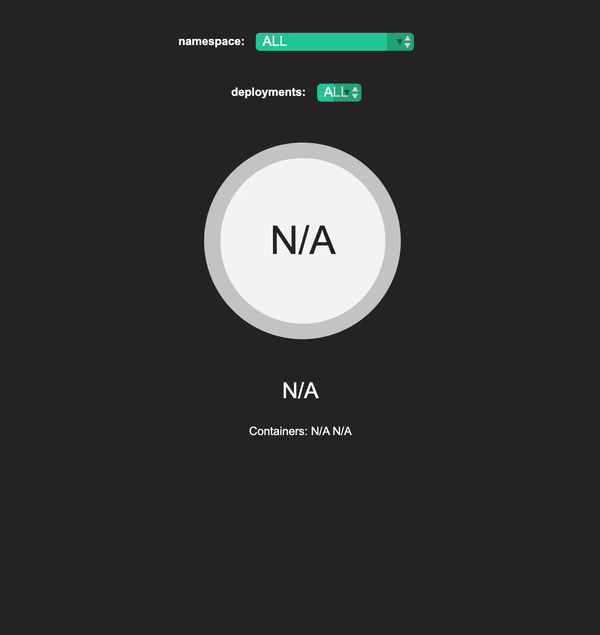

THIS REPO IS DEPRECATED, please refer to https://github.com/teleskopeView/teleskope_k8s
# teleskope
 


```go
	//Get namespaces list
	r.HandleFunc("/list/ns", func(w http.ResponseWriter, r *http.Request) {
		controller.GetNamespaces(h, w, r)
	})
	//return
	type NamespaceList struct{
		ID []string
	}
	//Get deployments list in namespace
	r.HandleFunc("/list/dep/{ns}", func(w http.ResponseWriter, r *http.Request) {
		controller.GetDeployments(h, w, r)
	})
	//return
	type deployments struct {
		ID []string
	}
	//Get specific deployment in namespace
	r.HandleFunc("/dep/{ns}/{dep}", func(w http.ResponseWriter, r *http.Request) {
		controller.GetDeployment(h, w, r)
	})
	//return 
	type Container struct{
		Name string
		Image string
		Envs []string
	}
	type DeploymentEvent struct{
		Name string
		Namespace string
		Containers []Container
		ReplicaCurrent string
		ReplicaDesired string
	}
	//Stream deployments event
	r.HandleFunc("/ws", func(w http.ResponseWriter, r *http.Request) {
		controller.StreamUpdateds(h, w, r)
	})
	//return 
	type Container struct{
		Name string
		Image string
		Envs []string
	}
	type DeploymentEvent struct{
		Name string
		Namespace string
		Containers []Container
		ReplicaCurrent string
		ReplicaDesired string
	}
```
